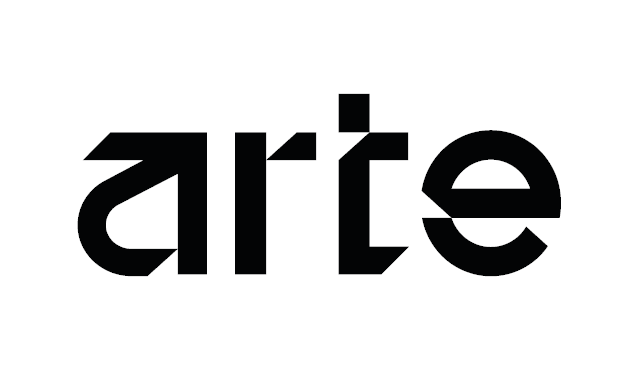

# Digital Twins for Mobility (DT4MOB)

Accelerating digital transformation in Portugal's mobility sector through an advanced digital twins platform.

## About

The Digital Twins for Mobility (DT4MOB) project aims to accelerate digital transformation in Portugal's mobility sector through an advanced digital twins platform. Aligned with the National Strategy for Smart Territories (ENTI) and European guidelines, DT4MOB supports the development and implementation of evidence-based public policies.

At its core, DT4MOB creates dynamic digital representations of road infrastructure, enabling real-time simulations, continuous monitoring, and optimized management of transportation systems.

## Key Features

- **Real-time Monitoring**: Continuous data collection from IoT sensors enabling live traffic flow and infrastructure status monitoring
- **Predictive Analytics**: AI-driven models that forecast maintenance needs and traffic patterns to minimize downtime and costs
- **5G Integration**: Leveraging ultra-low latency and high bandwidth for real-time synchronization across distributed systems
- **Data Security**: Federated learning approaches ensuring privacy compliance while maintaining platform accuracy

## Use Cases

- **Road Infrastructure Monitoring**: Monitoring retaining walls and slopes for enhanced safety and maintenance optimization
- **Climate-Resilient Highway Management**: Fire risk forecasting and climate adaptation strategies for highway operations
- **Traffic Management**: Real-time traffic monitoring and optimization to reduce congestion
- **Road Asset Management**: Comprehensive asset tracking and lifecycle management
- **Road Tolling Optimization**: Dynamic pricing and efficient toll processing systems

## Consortium

| Partner                                                                  | Role               |
| ------------------------------------------------------------------------ | ------------------ |
| [Instituto de Telecomunicações](https://www.it.pt/)                      | Project Lead       |
| [Infraestruturas de Portugal](https://www.infraestruturasdeportugal.pt/) | Strategic Partner  |
| [Brisa](https://brisagroup.pt/)                                          | Industrial Partner |
| [A-to-Be](https://www.a-to-be.com/)                                      | Industrial Partner |
| [IMT](https://www.imt-ip.pt/)                                            | Policy Partner     |

## Funded by

## Contact

Email: [jjcf@ua.pt](mailto:jjcf@ua.pt)